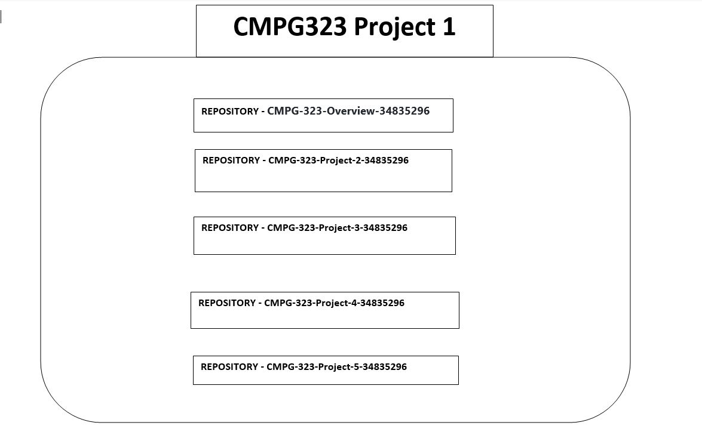

# CMPG-323-Overview-34835296
Project 1 repository:
This is the repository to be used to track everything for the Portfolio of Evidence

## Update
Covers the whole semester

## Repositories for the Project
There will be 5 repositories created for the project

1. CMPG-323-Overview-34835296 - Used for overall project
2. CMPG-323-Project-2-34835296 - Used for Project 2 
3. CMPG-323-Project-3-34835296 - Used for Project 3 
4. CMPG-323-Project-4-34835296 - Used for Project 4 
5. CMPG-323-Project-5-34835296 - Used for Project 5 

## Project and Repository context

##  .gitignore file
Project 1 - .gitignore wont be used
Project 2 - .gitignore will be used to ignore credentials
Project 3 - .gitignore will be used to ignore credentials
Project 4 - .gitignore will include .local,.settings,.tmh,.objects folders
Project 5 - .gitignore will include node_modules, .tmp and, dist folders

## Credentials and sensitive information
Hardcoded sensitive information and credentials should be removed from source code and git logs purged
Encrypted secrets to be used to store sensitive information in repositories

## Branching Strategy
Gitflow will be used as a branching strategy to develop the items required

