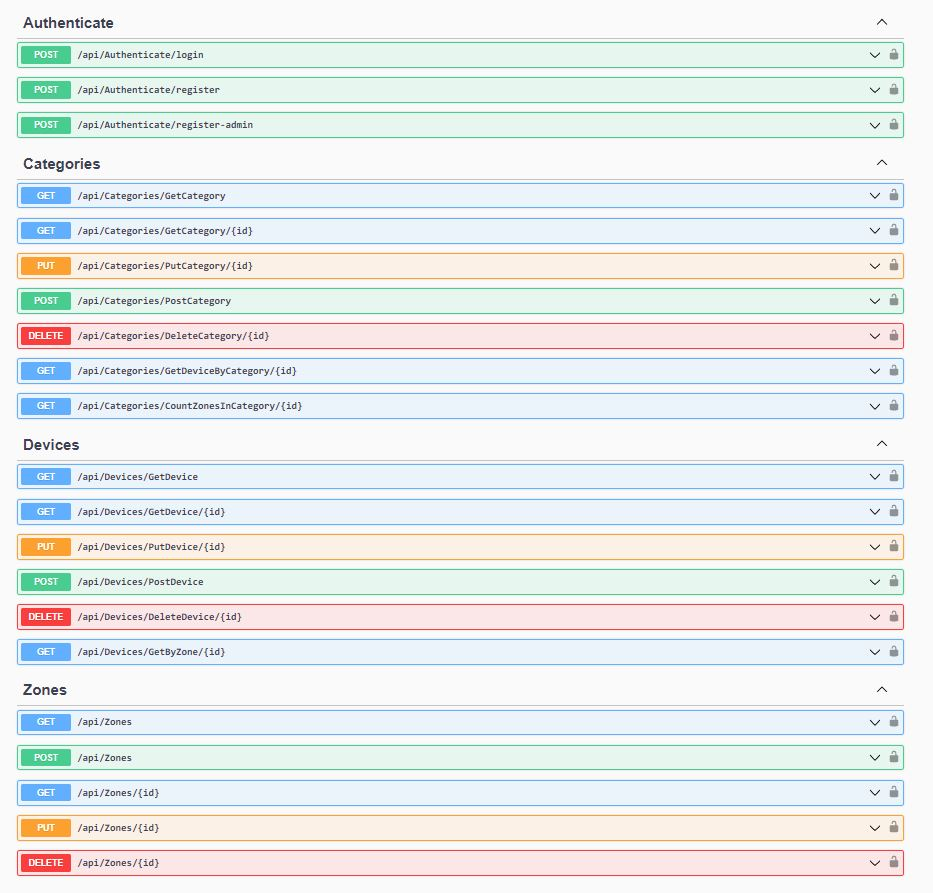

# CMPG-323-Overview-34835296
Project 1 repository:
This is the repository to be used to track everything for the Portfolio of Evidence

## Update
Covers the whole semester

## Repositories for the Project
There will be 5 repositories created for the project

1. CMPG-323-Overview-34835296 - Used for overall project
2. CMPG-323-Project-2-34835296 - Used for Project 2 
3. CMPG-323-Project-3-34835296 - Used for Project 3 
4. CMPG-323-Project-4-34835296 - Used for Project 4 
5. CMPG-323-Project-5-34835296 - Used for Project 5 

## Project and Repository context

##  .gitignore file
Project 1 - .gitignore wont be used  
Project 2 - .gitignore will be used to ignore credentials  
Project 3 - .gitignore will be used to ignore credentials  
Project 4 - .gitignore will include .local,.settings,.tmh,.objects folders  
Project 5 - .gitignore will include node_modules, .tmp and, dist folders  

## Credentials and sensitive information
Hardcoded sensitive information and credentials should be removed from source code and git logs purged
Encrypted secrets to be used to store sensitive information in repositories

## Branching Strategy
Gitflow will be used as a branching strategy to develop the items required

## Project 2  
This Project will be used to show how to create a CRUD RESTful API that will connect to a database storing IoT device data. The API contains at least one get, post, patch and delete method per resource.  

## Project 3  

## Project 4  

Before the solution can be deployed into production, it would need to go through UAT where a team of ‘testers’ would have a test dataset containing input data and desired output data. The testers would then insert each record of input data into each field of the web application and test that the desired output is generated. In this case, the desired output would be a new record being displayed on the web application once the item has been added. This would resort in a highly repetitive process which will be automated using RPA.

